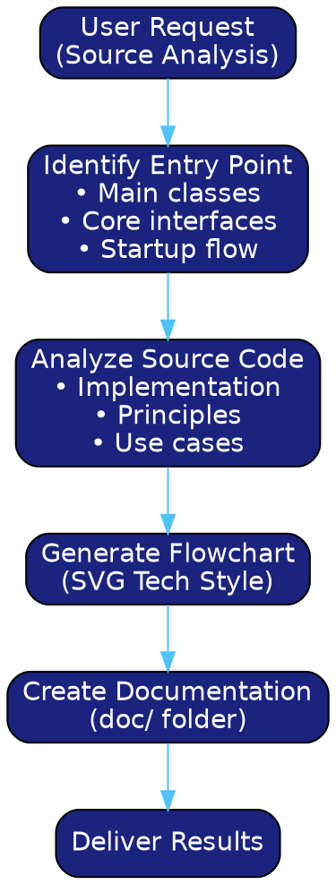

# Java Source Analyzer

## Overview

A comprehensive assistant for Java developers to deeply analyze open source project source code. Guides entry points, analyzes implementation principles, generates technical flowcharts with tech-blue glass UI, and produces structured documentation.

**Core Principle:** Transform complex source code reading into systematic exploration with visual aids and structured knowledge extraction.

## When to Use

Use this skill when:
- Starting to read a new Java open source project (JDK, Spring, MyBatis, Netty, RocketMQ, Redis, MySQL, JVM, Dubbo, Kafka, Elasticsearch, ZooKeeper, Guava, Caffeine, etc.)
- Need to understand internal implementation principles of a framework
- Want to analyze specific source code snippets for learning
- Creating technical documentation or study notes
- Preparing technical sharing or blog posts about source code

**Not for:**
- General Java programming questions unrelated to source code
- Debugging application code (use debugging skills instead)
- Performance profiling (use profiling tools instead)

## Workflow



## Core Capabilities

### 1. Entry Point Guidance

When user wants to read source code of a project, help identify the best entry points:

| Project Type | Entry Points |
|--------------|--------------|
| **JDK** | `java.lang.Thread`, `java.util.HashMap`, `java.nio.channels.Selector`, `java.util.concurrent` package |
| **Spring Boot** | `SpringApplication.run()`, `@SpringBootApplication`, `AutoConfiguration`, `DispatcherServlet` |
| **Spring Core** | `ApplicationContext`, `BeanFactory`, `@Autowired`, `AopProxy` |
| **MyBatis** | `SqlSessionFactory`, `MapperProxy`, `Executor`, `Cache` |
| **Netty** | `EventLoop`, `ChannelPipeline`, `ByteBuf`, `Bootstrap` |
| **RocketMQ** | `DefaultMQProducer`, `DefaultMQPushConsumer`, `BrokerController`, `MessageStore` |
| **Redis (Jedis)** | `JedisPool`, `Jedis`, `BinaryJedis`, `Connection` |
| **Redis (Redisson)** | `RedissonClient`, `RMap`, `RLock`, `CommandAsyncExecutor` |
| **MySQL Connector/J** | `ConnectionImpl`, `PreparedStatement`, `MysqlIO`, `Protocol` |
| **JVM** | `java.lang.ClassLoader`, `java.lang.ref.Reference`, `java.nio.DirectByteBuffer`, `sun.misc.Unsafe` |
| **Dubbo** | `ServiceConfig`, `ReferenceConfig`, `Invoker`, `Directory`, `LoadBalance` |
| **Kafka** | `KafkaProducer`, `KafkaConsumer`, `RecordAccumulator`, `NetworkClient` |
| **Elasticsearch** | `RestHighLevelClient`, `SearchRequest`, `IndexRequest`, `BulkProcessor` |
| **ZooKeeper** | `ZooKeeper`, `ClientCnxn`, `NIOServerCnxn`, `DataTree` |
| **Eureka** | `EurekaServerConfig`, `InstanceRegistry`, `PeerEurekaNodes`, `ApplicationResource` |
| **Nacos** | `NamingService`, `NamingFactory`, `ConsistencyService`, `DistroMapper` |
| **Consul** | `AgentClient`, `CatalogClient`, `HealthClient`, `KeyValueClient` |
| **Guava** | `CacheBuilder`, `LoadingCache`, `RateLimiter`, `EventBus` |
| **Caffeine** | `Caffeine`, `LoadingCache`, `BoundedLocalCache`, `Scheduler` |

**Questions to ask for entry guidance:**
- Which specific feature/area interests you most?
- What's your current understanding level (beginner/intermediate/advanced)?
- Any specific problem you're trying to solve?

### 2. Source Code Analysis

When analyzing source code snippets, provide:

#### Structure
```
## 代码片段分析：[Class/Method Name]

### 1. 核心作用 (Core Purpose)
简要说明这段代码的核心功能

### 2. 实现原理 (Implementation Principle)
- 关键算法或设计模式
- 数据结构选择
- 并发处理策略（如适用）

### 3. 使用场景 (Use Cases)
- 什么时候会调用这段代码
- 典型的调用链
- 与其他组件的交互

### 4. 核心方法解析 (Key Methods)
| 方法名 | 作用 | 关键逻辑 |
|--------|------|----------|
| method1 | ... | ... |

### 5. 知识点总结 (Key Takeaways)
- 涉及的 Java 特性
- 设计模式应用
- 性能考量
- 最佳实践
```

### 3. Flowchart Generation

**Visual Style: Light Theme Card Design**
参考风格：浅色系背景 + 圆角卡片 + 渐变色标题 + 网格背景

**Design Specifications:**
- **Canvas Size**: 2200×1600 (可铺满屏幕，保持比例缩放)
- **Background**: #f8fafc (浅灰蓝) + 网格纹理
- **Cards**: 白色圆角矩形 (rx="16") + 阴影效果
- **Header**: 渐变色标题栏 (不同主题不同渐变)
- **Typography**: SF Pro Display / system-ui
- **Layout**: 分组明确，留白充足，不重叠

**Color Palette:**
```
主背景: #f8fafc
网格线: #e2e8f0
卡片背景: #ffffff
卡片阴影: rgba(0,0,0,0.12)

渐变配色 (阶段区分):
- 紫色系: #6366f1 → #8b5cf6 (核心/主流程)
- 蓝色系: #3b82f6 → #2563eb (数据/存储)
- 绿色系: #10b981 → #059669 (成功/完成)
- 橙色系: #f59e0b → #d97706 (警告/注意)
- 粉色系: #ec4899 → #db2777 (事件/消息)
- 青色系: #06b6d4 → #0891b2 (辅助/工具)

文字颜色:
- 标题: #1e293b
- 正文: #334155
- 次要: #64748b
```

**SVG Template Structure:**
```xml
<svg xmlns="http://www.w3.org/2000/svg" viewBox="0 0 2200 1600"
     style="font-family: 'SF Pro Display', -apple-system, system-ui, sans-serif;">
  <defs>
    <!-- 渐变定义 -->
    <linearGradient id="headerGrad" x1="0%" y1="0%" x2="100%" y2="100%">
      <stop offset="0%" style="stop-color:#6366f1"/>
      <stop offset="100%" style="stop-color:#8b5cf6"/>
    </linearGradient>

    <!-- 阴影滤镜 -->
    <filter id="shadow" x="-30%" y="-30%" width="160%" height="160%">
      <feDropShadow dx="0" dy="4" stdDeviation="10"
                    flood-color="#000" flood-opacity="0.12"/>
    </filter>

    <!-- 网格背景 -->
    <pattern id="grid" width="30" height="30" patternUnits="userSpaceOnUse">
      <path d="M 30 0 L 0 0 0 30" fill="none" stroke="#e2e8f0" stroke-width="0.5"/>
    </pattern>

    <!-- 箭头标记 -->
    <marker id="arrow" markerWidth="14" markerHeight="14"
            refX="12" refY="7" orient="auto">
      <polygon points="0,0 14,7 0,14" fill="#6366f1"/>
    </marker>
  </defs>

  <!-- 背景 -->
  <rect width="2200" height="1600" fill="#f8fafc"/>
  <rect width="2200" height="1600" fill="url(#grid)"/>

  <!-- 主标题 -->
  <g filter="url(#shadow)">
    <rect x="450" y="20" width="1300" height="60" rx="15" fill="url(#headerGrad)"/>
    <text x="1100" y="50" text-anchor="middle" fill="white"
          font-size="24" font-weight="bold">标题文本</text>
    <text x="1100" y="72" text-anchor="middle" fill="rgba(255,255,255,0.85)"
          font-size="12">副标题说明</text>
  </g>

  <!-- 内容卡片组 -->
  <g transform="translate(50, 120)" filter="url(#shadow)">
    <rect x="0" y="0" width="500" height="400" rx="16"
          fill="white" stroke="#e2e8f0" stroke-width="2"/>
    <rect x="0" y="0" width="500" height="50" rx="16" fill="url(#headerGrad)"/>
    <rect x="0" y="35" width="500" height="15" fill="url(#headerGrad)"/>
    <text x="250" y="33" text-anchor="middle" fill="white"
          font-size="16" font-weight="bold">阶段标题</text>

    <!-- 内容项 -->
    <g transform="translate(25, 70)">
      <rect x="0" y="0" width="450" height="45" rx="8"
            fill="#fce7f3" stroke="#ec4899" stroke-width="1.5"/>
      <circle cx="25" cy="22" r="14" fill="url(#eventGrad)"/>
      <text x="25" y="27" text-anchor="middle" fill="white"
            font-size="12" font-weight="bold">1</text>
      <text x="50" y="18" fill="#9d174d" font-size="12" font-weight="bold">步骤标题</text>
      <text x="50" y="34" fill="#be185d" font-size="10">步骤说明</text>
    </g>
  </g>

  <!-- 连接箭头 -->
  <path d="M 550 320 L 620 320" stroke="#6366f1" stroke-width="3"
        marker-end="url(#arrow)"/>
</svg>
```

**File Naming Convention:**
- 使用中文描述 + 时间戳
- 格式: `[中文描述]_[YYYY-MM-DD]_[HHmmss].svg`
- 示例: `ArrayList扩容流程_2026-03-28_221500.svg`

**Layout Guidelines:**
1. **Viewport**: 固定 2200×1600，通过 CSS 或 viewBox 自适应屏幕
2. **Margins**: 四周留 50px 边距
3. **Card Spacing**: 卡片间距 30-40px
4. **Content Padding**: 卡片内边距 25px
5. **Text Hierarchy**: 标题 16-24px，正文 10-12px
6. **Max Cards Per Row**: 根据内容宽度，通常 3-4 个
7. **Flow Direction**: 左→右，上→下，箭头清晰指示流向

**Implementation:**
直接生成 `.svg` 文件，不生成中间 `.dot` 文件。
代码结构清晰，注释完整，便于后续修改。

### 4. Documentation Generation

**Directory Structure:**
```
doc/
└── [yyyy-MM-dd]-[topic-name]/
    ├── README.md              # 分析总结
    ├── [class-name].md        # 类详细分析
    └── diagrams/              # SVG 流程图（直接生成，无 dot 文件）
        ├── [中文描述]_YYYY-MM-DD_HHMMSS.svg
        └── ...
```

**File Naming Convention:**

Markdown 文件:
- Date prefix: `2024-01-15-`
- Topic: lowercase with hyphens
- Example: `2024-01-15-hashmap-analysis.md`

SVG 流程图文件:
- 中文描述 + 时间戳
- 格式: `[功能/流程描述]_[YYYY-MM-DD]_[HHMMSS].svg`
- Examples:
  - `ArrayList架构图_2026-03-28_143022.svg`
  - `扩容流程详图_2026-03-28_143045.svg`
  - `类继承关系图_2026-03-28_143108.svg`

**Important:**
- 直接生成 `.svg` 文件，不保留 `.dot` 中间文件
- SVG 使用参考的浅色系卡片风格
- 确保 SVG viewBox 正确设置，可自适应不同屏幕
- 文档中嵌入 SVG 使用标准 Markdown 图片语法

## Quick Reference

| Task | Command/Action |
|------|----------------|
| Find entry points | Analyze project's main classes, @ annotations, public APIs |
| Analyze a class | Read → Extract purpose → Identify key methods → Document |
| Create flowchart | Write SVG directly with light-theme card style → Save to diagrams/ |
| Save documentation | Create dated folder in `doc/` → Write markdown → Embed SVGs |

**When creating flowcharts:**
1. Canvas: 2200×1600, viewBox for responsive scaling
2. Use `<g transform="translate(x, y)">` for precise positioning
3. Cards: white bg, rx="16", filter="url(#shadow)"
4. Headers: gradient fills (purple/blue/green/orange/pink/cyan)
5. File naming: `[中文描述]_[YYYY-MM-DD]_[HHMMSS].svg`

## Common Mistakes

| Mistake | Fix |
|---------|-----|
| Starting from deep implementation | Start from public API, work inward |
| Ignoring initialization flow | Always trace how objects are created |
| Missing concurrency aspects | Check for synchronized, volatile, locks, thread pools |
| Over-documenting trivial code | Focus on non-obvious logic and design decisions |
| Flat documentation structure | Use hierarchical organization with clear entry point |

## Example Usage Scenarios

### Scenario 1: JDK HashMap Analysis
**User:** "我想了解 HashMap 的 put 方法原理"

**Response:**
1. Guide entry: `java.util.HashMap`
2. Analyze: put() → hash() → putVal() → resize() flow
3. Generate: HashMap structure diagram, put flowchart
4. Document: `doc/2024-01-15-hashmap-analysis/`

### Scenario 2: Spring Boot Startup
**User:** "Spring Boot 是怎么启动的？"

**Response:**
1. Guide entry: `SpringApplication.run()`
2. Analyze: SpringApplication → run() → prepareContext() → refresh()
3. Generate: Startup sequence diagram, auto-configuration flow
4. Document: `doc/2024-01-15-springboot-startup/`

### Scenario 3: RocketMQ Message Sending
**User:** "RocketMQ  producer 是怎么发送消息的？"

**Response:**
1. Guide entry: `DefaultMQProducerImpl.sendDefaultImpl()`
2. Analyze: 消息路由 → 队列选择 → 消息发送 → 结果处理
3. Generate: 消息发送流程图, 失败重试机制图
4. Document: `doc/2024-01-15-rocketmq-producer/`

### Scenario 4: Redis Connection Pool (Jedis)
**User:** "Jedis 连接池是怎么管理的？"

**Response:**
1. Guide entry: `JedisPool`, `JedisPoolConfig`
2. Analyze: 连接池初始化 → borrowObject → returnObject → 连接保活
3. Generate: 连接池架构图, 资源管理流程图
4. Document: `doc/2024-01-15-jedis-pool/`

### Scenario 5: MySQL Query Execution
**User:** "MySQL Connector/J 是怎么执行 SQL 的？"

**Response:**
1. Guide entry: `ConnectionImpl`, `PreparedStatement`
2. Analyze: SQL解析 → 参数绑定 → 协议编码 → 网络发送 → 结果解析
3. Generate: SQL执行流程图, 协议交互时序图
4. Document: `doc/2024-01-15-mysql-connector/`

### Scenario 6: JVM Class Loading
**User:** "JVM 类加载机制是怎么工作的？"

**Response:**
1. Guide entry: `java.lang.ClassLoader.loadClass()`
2. Analyze: 双亲委派 → findClass → defineClass → 链接初始化
3. Generate: 类加载流程图, 双亲委派模型图
4. Document: `doc/2024-01-15-jvm-classloader/`

### Scenario 7: Dubbo RPC Call
**User:** "Dubbo 一次 RPC 调用的完整流程是什么？"

**Response:**
1. Guide entry: `InvokerInvocationHandler`, `DubboInvoker`
2. Analyze: 服务引用 → 负载均衡 → 网络传输 → 服务执行 → 结果返回
3. Generate: RPC调用链路图, 集群容错流程图
4. Document: `doc/2024-01-15-dubbo-rpc/`

### Scenario 8: Kafka Producer
**User:** "Kafka Producer 是怎么发送消息的？"

**Response:**
1. Guide entry: `KafkaProducer.send()`, `RecordAccumulator`
2. Analyze: 消息累加 → 批量压缩 → 网络发送 → 应答处理
3. Generate: Producer架构图, 消息发送流程图
4. Document: `doc/2024-01-15-kafka-producer/`

### Scenario 9: Eureka Service Registration
**User:** "Eureka 服务注册和发现的原理是什么？"

**Response:**
1. Guide entry: `InstanceRegistry`, `PeerEurekaNodes`
2. Analyze: 服务注册 → 心跳续约 → 集群同步 → 服务发现
3. Generate: 注册中心架构图, 服务注册流程图, AP模式数据同步图
4. Document: `doc/2024-01-15-eureka-registry/`

### Scenario 10: Nacos Configuration Center
**User:** "Nacos 配置中心是怎么工作的？"

**Response:**
1. Guide entry: `NacosConfigService`, `ClientWorker`, `LongPollingRunnable`
2. Analyze: 配置发布 → 长轮询监听 → 配置推送 → 本地缓存更新
3. Generate: 配置中心架构图, 长轮询机制图, 配置变更推送流程图
4. Document: `doc/2024-01-15-nacos-config/`

### Scenario 11: Nacos Service Discovery
**User:** "Nacos 服务发现和负载均衡是怎么实现的？"

**Response:**
1. Guide entry: `NamingService`, `HostReactor`, `PushReceiver`
2. Analyze: 服务注册 → 健康检查 → 服务订阅 → 推送/拉取
3. Generate: 服务发现架构图, 健康检查流程图, 负载均衡策略图
4. Document: `doc/2024-01-15-nacos-discovery/`

### Scenario 12: ZooKeeper Leader Election
**User:** "ZooKeeper 是怎么选举 Leader 的？"

**Response:**
1. Guide entry: `FastLeaderElection`, `QuorumPeer`
2. Analyze: LOOKING → 选票交换 → 计票比较 → LEADING/FOLLOWING
3. Generate: 选举流程图, 状态转换图, ZAB协议架构图
4. Document: `doc/2024-01-15-zookeeper-election/`

### Scenario 13: Consul Service Discovery
**User:** "Consul 的服务发现和键值存储是怎么工作的？"

**Response:**
1. Guide entry: `AgentClient`, `CatalogClient`, `KeyValueClient`
2. Analyze: 服务注册 → 健康检查 → KV存储 → 服务查询
3. Generate: 服务网格架构图, 健康检查流程图, Gossip协议通信图
4. Document: `doc/2024-01-15-consul-discovery/`

## Implementation Notes

**When analyzing source code:**
1. Always identify the entry method first
2. Trace the call chain step by step
3. Highlight design patterns used
4. Explain "why" not just "what"
5. Connect to practical use cases

**When generating flowcharts:**
1. Canvas size: 2200×1600, maintain aspect ratio
2. Use transform="translate(x, y)" for precise positioning
3. Cards: white background, rounded corners (rx="16"), shadow filter
4. Headers: gradient fills matching the flow type
5. Layout: group related content, clear visual hierarchy
6. Arrows: use markers for clear direction indication
7. Text: hierarchical sizing (title 16-24px, body 10-12px)
8. Spacing: 50px margins, 30-40px between cards

**When creating documentation:**
1. Create folder with today's date prefix
2. Include README.md as index
3. Embed SVGs using ``
4. Use Chinese filename format: `[描述]_[日期]_[时间].svg`
5. Cross-reference related files
